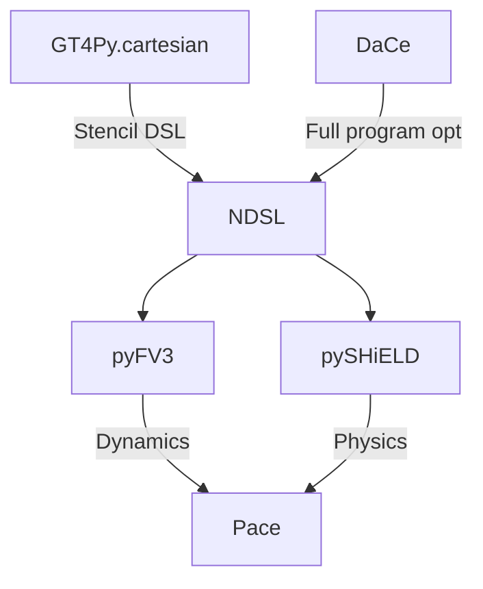

[![Contributors][contributors-shield]][contributors-url]
[![Stargazers][stars-shield]][stars-url]
[![Issues][issues-shield]][issues-url]
[![Apache License][license-shield]][license-url]

# Pace

Pace is an implementation of the FV3GFS / SHiELD atmospheric model developed by NOAA/GFDL using the [NDSL](https://github.com/NOAA-GFDL/NDSL) middleware in Python, itself based on [GT4Py](https://github.com/GridTools/gt4py) and [DaCe](https://github.com/spcl/dace). The model can be run on a laptop using Python-based backend or on thousands of heterogeneous compute nodes of a large supercomputer.

🚧 **WARNING** This repo is under active development - supported features and procedures can change rapidly and without notice. 🚧

The repository model code is split between [pyFV3](https://github.com/NOAA-GFDL/pyFV3) for the dynamical core and [pySHiELD](https://github.com/NOAA-GFDL/pySHiELD) for the physics parametrization. A full depencies looks like the following:



## Quickstart - bare metal

### Build

Pace requires:

- GCC > 9.2
- MPI
- Python 3.8.

For GPU backends CUDA and/or ROCm is required depending on the targeted hardware.

For GT stencils backends, you will also need the headers of the boost libraries in your `$PATH`. This could be down like this.

```shell
cd BOOST/ROOT
wget https://boostorg.jfrog.io/artifactory/main/release/1.79.0/source/boost_1_79_0.tar.gz
tar -xzf boost_1_79_0.tar.gz
mkdir -p boost_1_79_0/include
mv boost_1_79_0/boost boost_1_79_0/include/
export BOOST_ROOT=BOOST/ROOT/boost_1_79_0
```

When cloning Pace you will need to update the repository's submodules as well:

```shell
git clone --recursive https://github.com/NOAA-GFDL/pace.git
```

or if you have already cloned the repository:

```
git submodule update --init --recursive
```

We recommend creating a python `venv` or `conda` environment specifically for Pace.

```shell
python3 -m venv venv_name
source venv_name/bin/activate
```

Inside of your pace `venv` or conda environment pip install the Python requirements, GT4Py, and Pace:

```shell
pip3 install -r requirements_dev.txt -c constraints.txt
```

Shell scripts to install Pace on specific machines such as Gaea can be found in `examples/build_scripts/`.

### Run

With the environment activated, you can run an example baroclinic test case with the following command:

```shell
mpirun -n 6 python3 -m pace.driver.run driver/examples/configs/baroclinic_c12.yaml

# or with oversubscribe if you do not have at least 6 cores
mpirun -n 6 --oversubscribe python3 -m pace.driver.run driver/examples/configs/baroclinic_c12.yaml
```

After the run completes, you will see an output direcotry `output.zarr`. An example to visualize the output is provided in `driver/examples/plot_output.py`. See the [driver example](driver/examples/README.md) section for more details.

### Environment variable configuration

- `PACE_CONSTANTS`: Pace is bundled with various constants.
  - `GFDL` NOAA's FV3 dynamical core constants (original port)
  - `GFS` Constant as defined in NOAA GFS
  - `GEOS`  Constant as defined in GEOS v13
- `PACE_FLOAT_PRECISION`: default precision of the field & scalars in the numerics. Default to 64.
- `PACE_LOGLEVEL`: logging level to display (DEBUG, INFO, WARNING, ERROR, CRITICAL). Default to INFO.

## Quickstart - Docker

### Build

While it is possible to install and build pace bare-metal, we can ensure all system libraries are installed with the correct versions by using a Docker container to test and develop pace.

First, you will need to update the git submodules so that any dependencies are cloned and at the correct version:

```shell
git submodule update --init --recursive
```

Then build the `pace` docker image at the top level.

```shell
make build
```

### Run

```shell
make dev
mpirun --mca btl_vader_single_copy_mechanism none -n 6 python3 -m pace.driver.run /pace/driver/examples/configs/baroclinic_c12.yaml
```

## History

This repository was first developed at [AI2](https://github.com/ai2cm/pace) and the institute conserves an archived copy with the latest state before the NOAA took over.

[contributors-shield]: https://img.shields.io/github/contributors/ai2cm/pace.svg
[contributors-url]: https://github.com/NOAA-GFDL/pace/graphs/contributors
[stars-shield]: https://img.shields.io/github/stars/NOAA-GFDL/pace.svg
[stars-url]: https://github.com/NOAA-GFDL/pace/stargazers
[issues-shield]: https://img.shields.io/github/issues/NOAA-GFDL/pace.svg
[issues-url]: https://github.com/NOAA-GFDL/pace/issues
[license-shield]: https://img.shields.io/github/license/NOAA-GFDL/pace.svg
[license-url]: https://github.com/NOAA-GFDL/pace/blob/main/LICENSE.md
